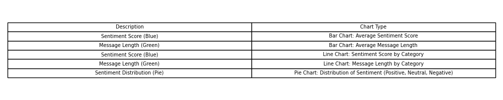

# buzzline-06-tesfai

This project processes real-time messages using a Kafka producer-consumer system. The producer generates and sends messages, while the consumer processes those messages and stores sentiment analysis results in an SQLite database for further insights.

## Overview

The **buzzline-06-tesfai** project handles real-time data streams using Kafka. It includes a custom producer that sends messages, a consumer that processes and analyzes these messages, and stores the results in an SQLite database. The sentiment analysis helps to categorize and understand the tone of the incoming messages.

## Project Structure

Here is an overview of the folders and their contents:

- `producers/`: Contains scripts that generate and send messages to Kafka.
- `consumers/`: Handles processing of incoming messages and stores results into a database.
- `data/`: Contains data files used for input or output during the project.
- `utils/`: Utility functions that support the main processes, such as Kafka connections or sentiment analysis.
- `logs/`: Stores logs related to the producers and consumers for debugging and monitoring.
- `visualization/`: Contains scripts that generate charts based on processed data (Bar Chart, Line Chart, Pie Chart).

## Prerequisites

1. **Python 3.11** (or higher)
2. **Kafka** (running locally or remotely)
3. **Zookeeper** (used for managing Kafka's cluster)
4. **SQLite** (for storing processed results)

## Setup Instructions

Follow these steps to get your environment ready:

1. Clone the repository:
    ```shell
    git clone https://github.com/yourusername/buzzline-06-tesfai.git
    cd buzzline-06-tesfai
    ```

2. Set up a Python virtual environment:
    ```shell
    python3 -m venv .venv
    source .venv/bin/activate  # For Mac/Linux
    .venv\\Scripts\\activate    # For Windows
    ```

3. Install dependencies from `requirements.txt`:
    ```shell
    pip install -r requirements.txt
    ```

4. Set up the environment variables in `.env` as needed for your project configuration.

## Start Zookeeper and Kafka

1. **Start Zookeeper**:  
   Zookeeper must be running for Kafka to function. To start Zookeeper:
    ```shell
    cd /path/to/kafka/bin
    ./zookeeper-server-start.sh ../config/zookeeper.properties
    ```
    You can also run this in the background:
    ```shell
    ./zookeeper-server-start.sh ../config/zookeeper.properties &
    ```

2. **Start Kafka**:  
   After starting Zookeeper, Kafka must be started. To start Kafka:
    ```shell
    cd /path/to/kafka/bin
    ./kafka-server-start.sh ../config/server.properties
    ```
    Similarly, you can run this in the background:
    ```shell
    ./kafka-server-start.sh ../config/server.properties &
    ```

    Ensure both Zookeeper and Kafka are running in separate terminals if you're not using the background option.

3. **Kafka Topic Creation**:  
   Ensure the Kafka topic exists. If not, you can create it by running:
    ```shell
    ./kafka-topics.sh --create --topic trending_topics --bootstrap-server localhost:9092 --partitions 1 --replication-factor 1
    ```
    Replace `trending_topics` with your desired topic name. This topic is where the producer will send messages and the consumer will receive them.

4. **Kafka and Zookeeper Logs**:  
   If there are any issues, check the log files:
    - Zookeeper logs can be found in `logs/zookeeper.log`.
    - Kafka logs can be found in `logs/server.log`.

## Running the Project

### Producer (Sending Messages)

1. **Activate the virtual environment** (if not already done):
    ```shell
    source .venv/bin/activate  # For Mac/Linux
    .venv\\Scripts\\activate    # For Windows
    ```

2. **Run the producer script** to begin sending messages:
    ```shell
    py -m producers.producer_tesfai
    ```

3. **Verify** that messages are being consumed by checking the database or the logs.

### Consumer (Processing Messages)

1. **Activate the virtual environment** (if not already done):
    ```shell
    source .venv/bin/activate  # For Mac/Linux
    .venv\\Scripts\\activate    # For Windows
    ```

2. **Run the consumer script** to start processing messages:
    ```shell
    py -m consumers.consumer_tesfai
    ```

### Visualization (Displaying Results)

1. **Activate the virtual environment** (if not already done):
    ```shell
    source .venv/bin/activate  # For Mac/Linux
    .venv\\Scripts\\activate    # For Windows
    ```

2. **Run the producer script** to begin sending messages:
    ```shell
    py -m producers.producer_tesfai
    ```

3. **Run the consumer script** to start processing messages:
    ```shell
    py -m consumers.consumer_tesfai
    ```

4. **Run the visualization script** to generate charts based on the consumed data:
    ```shell
    python -m visualization.visualization
    ```

    This will generate a **Bar Chart**, **Line Chart**, and **Pie Chart** for sentiment analysis and message lengths.

---

### Explanation of Structure:

1. **Project Title (`# buzzline-06-tesfai`)**: This is the heading at the top of the file.
2. **Project Overview**: This section introduces what the project is about.
3. **Project Structure**: Lists and describes the folders in your project.
4. **Prerequisites**: Requirements for the system to run the project, including Python version and other tools.
5. **Setup Instructions**: A step-by-step guide to setting up the environment, including cloning the repository, setting up the virtual environment, and installing dependencies.
6. **Running the Project**: Instructions on how to run both the producer and the consumer, which are the core of the system.
7. **License**: A section about the MIT License for the project.

## Visualizations

### 1. Sentiment Bar and Line Chart

This chart shows the average sentiment scores and message lengths across different categories.


### 2. Sentiment Distribution (Pie Chart)

This pie chart represents the distribution of sentiments: Positive, Neutral, and Negative.


### 3. Chart Descriptions Table

This table describes the various charts included in this report.



---

### Additional Notes:

- Ensure you run **all three scripts** in the order: **Producer → Consumer → Visualization** to visualize the data.
- You may adjust the **sentiment score range** or other parameters in the producer script to simulate more realistic data.